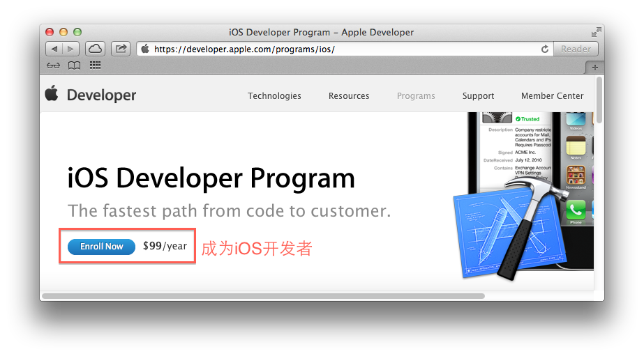
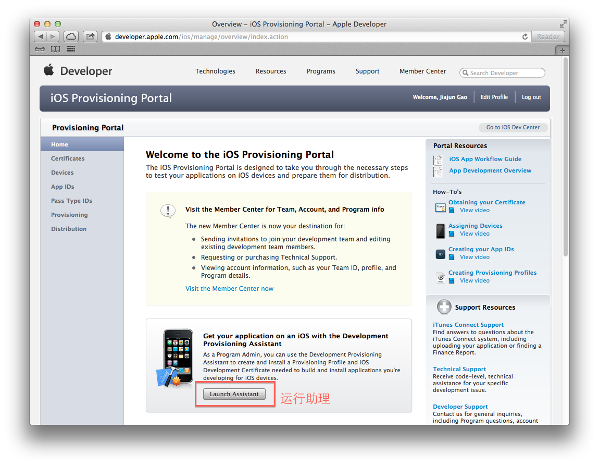

成为iOS开发者
==
移动互联网发展的如火如荼，iOS平台无疑是这个如火如荼的市场上最火热的一个平台。为了保障iOS的生态系统健康，Apple对iOS开发者和iOS应用的审核都很严格，那么如何成为一个iOS开发者，开发一款iOS App。

开发一款iOS App需要一台Mac OSX电脑，Xcode，iOS SDK和一个iOS开发者账号。

下载Xcode和iOS SDK
---
在Mac App Store里可以下载最新版本的Xcode。这个Xcode包含了iOS SDK，iOS设备模拟器，静态分析工具，Interface Builder，等需要用到的全部工具。

下载地址：[http://itunes.apple.com/us/app/xcode/id497799835?ls=1&mt=12](http://itunes.apple.com/us/app/xcode/id497799835?ls=1&mt=12)

注册成为iOS开发者
---
注册成为iOS开发者，需要付99美元，后才能在iOS设备上调试程序，并发布应用到App Store，并且查看全部开发文档。
文档地址：[https://developer.apple.com/programs/ios/](https://developer.apple.com/programs/ios/)

在这里完成线上注册流程，Apple将会提供给你一张Purchase Form，需要你填写账户信息，信用卡信息等，并传真给Apple。Apple将在两周以内完成注册流程，发送一封确认邮件到你注册时的邮箱，通知你正式成为iOS开发者。

下载证书，配置环境
---
登陆开发者网站，访问Provisioning Portal

[https://developer.apple.com/ios/manage/overview/index.action](https://developer.apple.com/ios/manage/overview/index.action)

运行Development Provisioning Assistant，按照提示一步一步进行。

注册成功iOS开发者，并把开发环境配置完后，就可以开发iOS应用，并在真是设备进行调试了。
